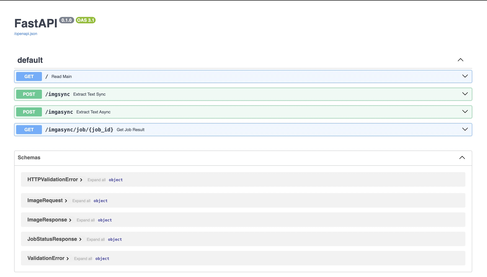
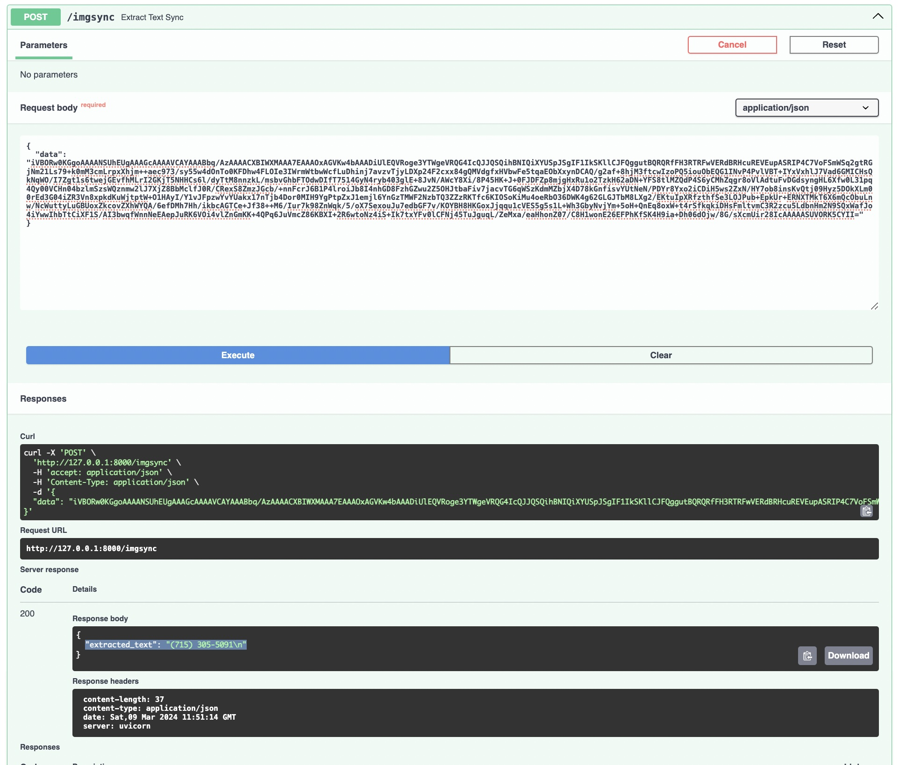
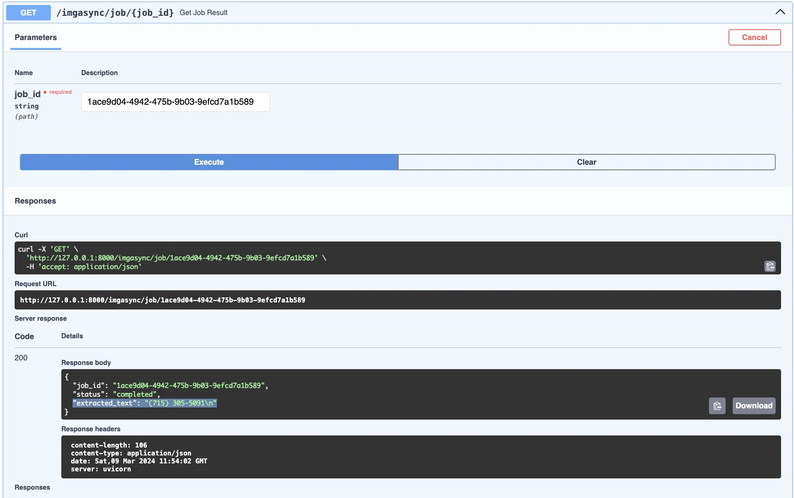

# OCR Web Service

- This document provides instructions on building, running, and using the OCR web service.

## Table of Contents
- [Building the OCR Web Service](#building-the-ocr-web-service)
  - [Prerequisites](#prerequisites)
  - [Instructions](#instructions)
- [Running the OCR Web Service](#running-the-ocr-web-service)
  - [Instructions](#instructions-1)
- [Using the OCR Web Service](#using-the-ocr-web-service)
  - [Synchronous Endpoint (imgsync)](#synchronous-endpoint-imgsync)
  - [Asynchronous Endpoint (imgasync)](#asynchronous-endpoint-imgasync)
  - [Check Job Status](#check-job-status)
- [Reference](#reference)
  - [Commands in Makefile](#command-in-makefile)
  - [Core Hierarchy](#core-hierarchy)
  - [Demo](#demo)

## Building the OCR Web Service
### Prerequisites
- [Docker](https://www.docker.com/) installed

### Instructions
1. **Unzip the OCR repository:**
   ```shell
   unzip ocr.zip
   cd ocr
   ```
2. Build the Docker image:
    ```shell
    make docker-build
    ```

## Running the OCR Web Service
### Instructions
1. Run the Docker container:
   ```shell
   make docker-run
   ```
   - This will start the OCR web service on http://localhost:8000. You can change the port in the docker run command if needed.

2. Access the Swagger Documentation:
- Visit http://localhost:8000/docs in your web browser to access the interactive Swagger documentation. This provides details on the available endpoints, request formats, and response structures.


## Using the OCR Web Service
- The OCR web service provides both synchronous and asynchronous endpoints for text extraction from images.
### Synchronous Endpoint (`imgsync`)
- URL: http://localhost:8000/imgsync
- Method: POST
- Request Body:
   ```json
   {
     "data": "base64_encoded_image"
   }
   ```
- Response:
   ```json
   {
     "extracted_text": "extracted_text"
   }
   ```

### Asynchronous Endpoint (`imgasync`)
- URL: http://localhost:8000/imgasync
- Method: POST
- Request Body:
   ```json
   {
     "data": "base64_encoded_image"
   }
   ```
- Response:
   ```json
   {
     "job_id": "unique_job_id"
   }
   ```
### Check Asynchronous Job Status
- URL: http://localhost:8000/imgasync/job/{job_id}
- Method: GET
- Response:
   ```json
   {
     "job_id": "job_id",
     "status": "completed",
     "extracted_text": "extracted_text"
   }
   ```
## Reference
### Commands in Makefile
1. `make clean`: Removes Python compiled files and cache locally.
2. `make install`: Installs project dependencies locally.
3. `make run`: Runs the OCR web service using Uvicorn locally.
4. `make test`: Runs the tests using pytest locally.
5. `make docker-run`: Builds a Docker image for the OCR web service and runs it.


### Core Hierarchy
```bash
ocr
├── __init__.py
├── core
│   ├── __init__.py
│   ├── job_manager.py
│   └── schemas
│       ├── __init__.py
│       └── image.py
├── dependencies.py
├── logger
│   ├── __init__.py
│   └── logger.py
├── main.py
└── routers
    ├── __init__.py
    ├── image_sync.py
    └── image_async.py
    └── utils.py
```

### Demo by Swagger UI
1. `/imgsync`
- Input an encoded image data, get the result as


2. `/imgasync`
- Input an encoded image data, get the result as


3. `/imgasync/job/`
- Based on the `job_id` from `/imgasync`, we have

